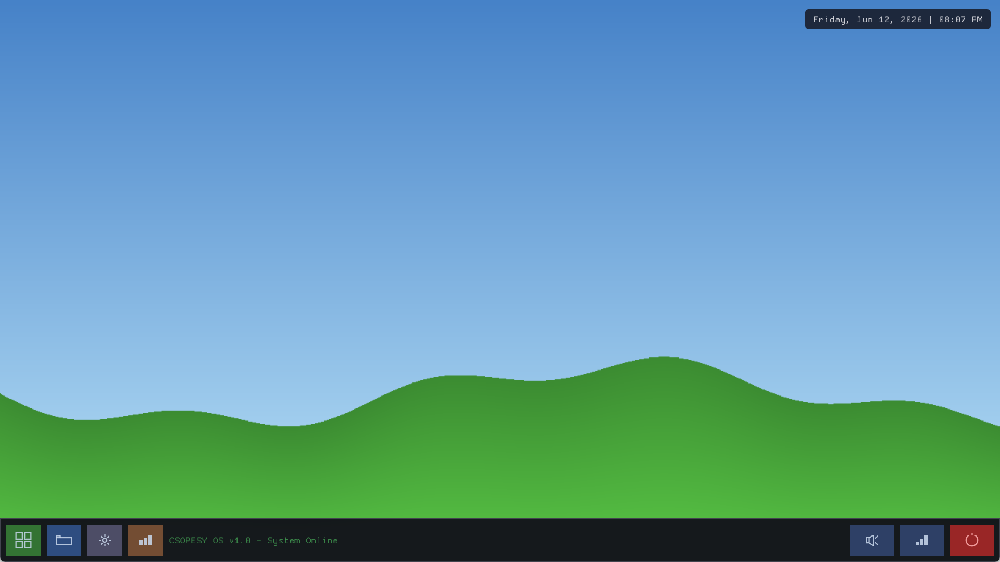
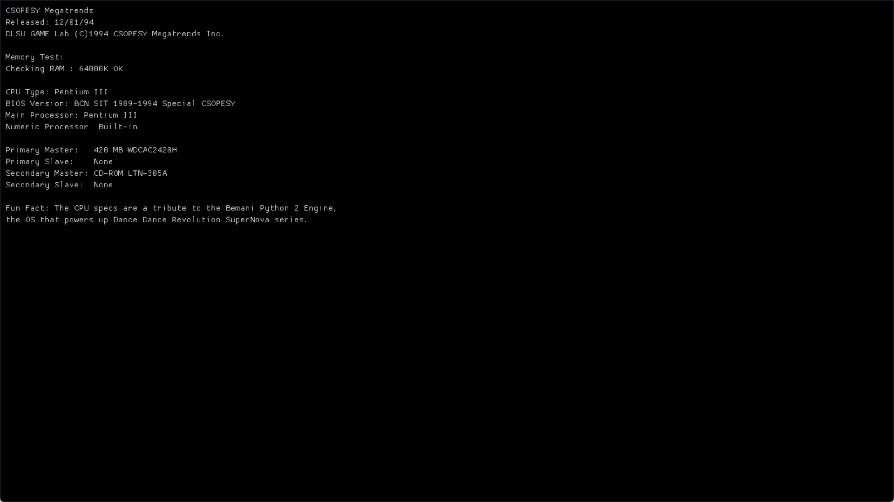
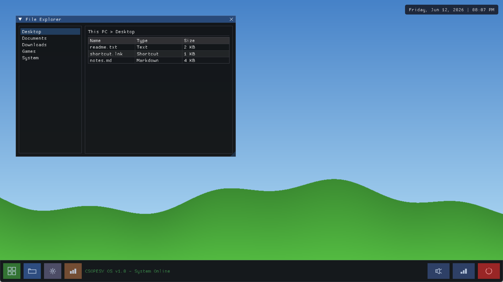
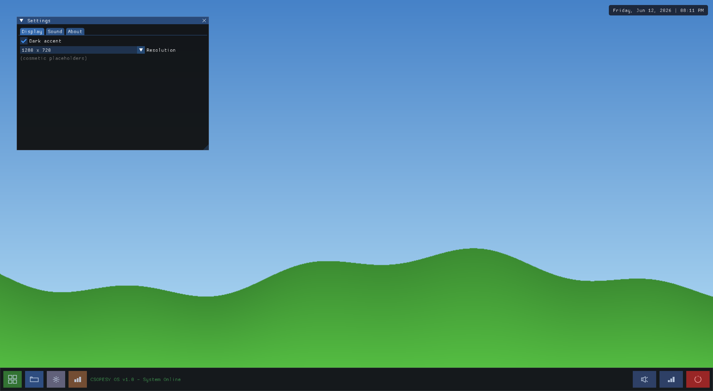
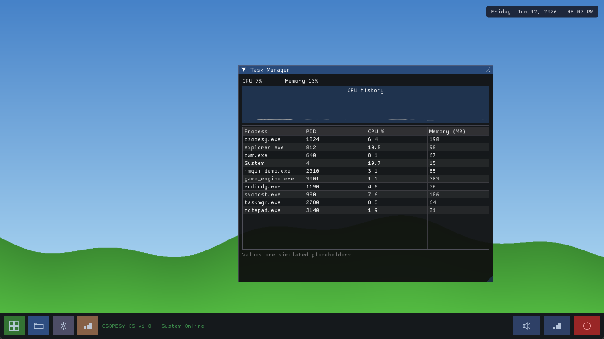
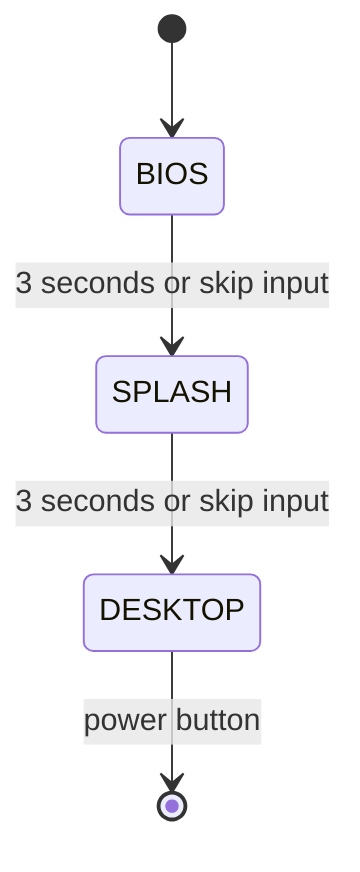
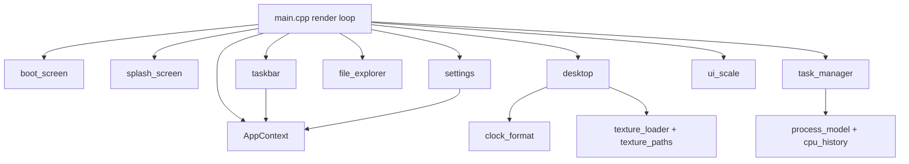

# CSOPESY Desktop OS Mockup

A desktop-style operating system emulator built in C++20 with Dear ImGui, GLFW,
and OpenGL. The app boots through a BIOS POST sequence and animated loading
splash before entering a resizable desktop with a live clock, icon taskbar,
File Explorer, Settings, and an animated Task Manager.



## Highlights

- Animated three-stage flow: **BIOS -> Splash -> Desktop**
- BIOS text reveal with CSOPESY hardware details and a Bemani Python 2 tribute
- Three-second loading splash with animated dots and a smooth progress bar
- Monitor-aware startup window sized to 75% of the primary display
- Adaptive UI density from the original 1280x720 layout up to 150%
- Large custom-drawn taskbar icons with hover and active feedback
- Live date and time overlay
- Wallpaper texture loading with a built-in gradient fallback
- File Explorer, Settings, and Task Manager utility windows
- Pure logic units covered by a doctest suite

## Screenshots

| Screen | Current UI |
| --- | --- |
| BIOS POST |  |
| Loading splash |  |
| Desktop |  |
| File Explorer |  |
| Settings |  |
| Task Manager |  |

## Desktop Functions

### Boot sequence

- **BIOS POST:** Reveals system information line-by-line over three seconds.
- **Loading splash:** Shows the CSOPESY title, credits, animated loading text,
  and a progress bar over three seconds.
- **Skip controls:** Left-click, `Space`, `Enter`, or `Escape` advances to the
  next boot stage immediately.

### Taskbar

The bottom taskbar uses custom `ImDrawList` icons instead of text buttons.
Buttons scale with the rest of the interface and provide hover/active tints.

| Position | Icon | Function |
| --- | --- | --- |
| Left | Green grid | Decorative Start-style button |
| Left | Folder | Toggle File Explorer |
| Left | Gear | Toggle Settings |
| Left | Bar chart | Toggle Task Manager |
| Right | Speaker | Open Settings directly on the Sound tab |
| Right | Signal bars | Decorative network indicator |
| Right | Power | Shut down the emulator cleanly |

The center taskbar status reads `CSOPESY OS v1.0 - System Online`.

### File Explorer

- Two-pane layout with folder navigation and file details
- Desktop, Documents, Downloads, Games, and System folders
- Resizable Name, Type, and Size columns

### Settings

- **Display:** Cosmetic dark-accent toggle and resolution selector
- **Sound:** Master-volume slider and progress indicator
- **About:** Emulator, hardware, and group information
- Clicking the taskbar speaker icon opens Settings directly on **Sound**

### Task Manager

- Simulated process list with PID, CPU, and memory columns
- Animated per-process values
- Aggregate CPU and memory status
- Rolling CPU-history graph
- Resizable and scrollable process table

## Adaptive UI Scaling

The app starts at 75% of the primary monitor resolution and centers itself on
the display. UI density is calculated once at startup from the original
1280x720 design baseline:

```text
scale = clamp(min(windowWidth / 1280, windowHeight / 720), 1.0, 1.5)
```

The shared scale is applied to:

- ImGui fonts, padding, spacing, controls, tabs, and title bars
- BIOS and splash content
- Desktop clock
- Taskbar height, buttons, custom icons, and strokes
- File Explorer, Settings, and Task Manager default sizes
- Explicit pane, chart, and table dimensions

This keeps the app readable on larger displays while preserving the original
layout density on smaller windows.

## Quick Start

### Requirements

| Requirement | Notes |
| --- | --- |
| CMake 3.16+ | Configures the project and FetchContent dependencies |
| C++20 compiler | Visual Studio 2022+ is the primary Windows toolchain |
| OpenGL | Provided by the system graphics driver |
| Network access | Required during the first configure to fetch ImGui and GLFW |

### Build and run on Windows

Open PowerShell in the repository root:

```powershell
cmake -S . -B build
cmake --build build --config Release
.\build\Release\csopesy_os.exe
```

After the first successful build, run the app with:

```powershell
.\build\Release\csopesy_os.exe
```

Run the executable from the repository root so `assets/wallpaper.png` resolves.
If the wallpaper cannot be found, the desktop automatically uses its gradient
fallback.

### MinGW alternative

```powershell
cmake -S . -B build -G "MinGW Makefiles"
cmake --build build
.\build\csopesy_os.exe
```

## Controls

| Context | Input | Action |
| --- | --- | --- |
| BIOS or Splash | Left-click, `Space`, `Enter`, or `Escape` | Advance to the next stage |
| Desktop taskbar | Folder icon | Toggle File Explorer |
| Desktop taskbar | Gear icon | Toggle Settings |
| Desktop taskbar | Bar-chart icon | Toggle Task Manager |
| Desktop taskbar | Speaker icon | Open Settings on Sound |
| Desktop taskbar | Power icon | Shut down the emulator |
| Utility window | Drag title bar | Move window |
| Utility window | Drag edge or corner | Resize window |
| Utility window | Close button | Close window |

## Architecture

### Runtime state flow



### Component flow



### Design notes

- **Shared application state:** `AppContext` owns boot state, UI scale, window
  flags, wallpaper state, volume, shutdown state, and Task Manager data.
- **Logic/render split:** The `csopesy_logic` library has no ImGui dependency
  and is linked by both the app and the test executable.
- **Immediate-mode rendering:** Each visible screen and utility is rendered
  every frame from the current `AppContext`.
- **Graceful asset failure:** Missing wallpaper assets do not prevent startup.

## Project Structure

```text
Desktop-Style-OS-Mockup/
|-- assets/
|   `-- wallpaper.png
|-- docs/
|   |-- images/                         # Current README screenshots
|   `-- superpowers/
|       |-- plans/                      # Implementation plans
|       `-- specs/                      # Design specifications
|-- src/
|   |-- main.cpp                        # GLFW, ImGui, OpenGL, state dispatch
|   |-- app_context.h                   # Shared mutable application state
|   |-- logic/
|   |   |-- boot_state.h/.cpp           # BIOS/Splash/Desktop transitions
|   |   |-- clock_format.h/.cpp         # Live clock formatting
|   |   |-- cpu_history.h               # Fixed-capacity CPU history buffer
|   |   |-- process_model.h/.cpp        # Simulated process data
|   |   |-- texture_paths.h/.cpp        # Wallpaper search paths
|   |   `-- ui_scale.h/.cpp             # UI and taskbar-icon scale rules
|   `-- render/
|       |-- boot_screen.h/.cpp           # BIOS renderer
|       |-- splash_screen.h/.cpp         # Splash and progress-bar renderer
|       |-- desktop.h/.cpp               # Wallpaper/fallback and clock
|       |-- taskbar.h/.cpp               # Icon taskbar and interactions
|       |-- texture_loader.h/.cpp        # stb_image to OpenGL texture
|       `-- windows/
|           |-- file_explorer.h/.cpp
|           |-- settings.h/.cpp
|           `-- task_manager.h/.cpp
|-- tests/
|   |-- test_main.cpp
|   |-- test_boot_state.cpp
|   |-- test_clock_format.cpp
|   |-- test_cpu_history.cpp
|   |-- test_process_model.cpp
|   |-- test_texture_paths.cpp
|   `-- test_ui_scale.cpp
|-- third_party/
|   |-- doctest.h
|   |-- stb_image.h
|   `-- stb_image_write.h
|-- tools/
|   |-- capture_window.ps1               # Capture app client-area screenshots
|   |-- click_client.ps1                 # Click app client coordinates
|   `-- make_wallpaper.cpp               # Wallpaper generator
`-- CMakeLists.txt
```

## Testing

Build the project, then run CTest:

```powershell
cmake --build build --config Release
ctest --test-dir build -C Release --output-on-failure
```

Run the doctest executable directly for the detailed case/assertion count:

```powershell
.\build\Release\csopesy_tests.exe
```

The current suite contains **20 test cases** and **20,033 assertions** covering:

| Test file | Coverage |
| --- | --- |
| `test_boot_state.cpp` | Timed and skipped state transitions |
| `test_clock_format.cpp` | Clock text and AM/PM formatting |
| `test_cpu_history.cpp` | Capacity, ordering, and buffer behavior |
| `test_process_model.cpp` | Determinism, ranges, and aggregate values |
| `test_texture_paths.cpp` | Executable-relative and working-directory paths |
| `test_ui_scale.cpp` | Baseline, limits, aspect ratios, and taskbar icon size |

## Troubleshooting

### Wallpaper does not load

Run the executable from the repository root:

```powershell
.\build\Release\csopesy_os.exe
```

The app searches multiple executable-relative and working-directory candidates.
It uses a gradient background if none are available.

### First configure takes time

CMake uses `FetchContent` to download Dear ImGui v1.91.5 and GLFW 3.4 during
the first configure. Later builds reuse the downloaded sources in `build/`.

### Window layout changed between runs

Dear ImGui writes local window positions and sizes to `imgui.ini`. The file is
ignored by Git. Delete it to reset saved utility-window positions.

## Dependencies and Credits

- **Authors:** S09 Group 2 - Cumti, Dulatre, Hong, Pineda
- [Dear ImGui](https://github.com/ocornut/imgui) v1.91.5
- [GLFW](https://www.glfw.org/) 3.4
- [stb](https://github.com/nothings/stb) image loading and PNG generation
- [doctest](https://github.com/doctest/doctest) v2.4.11
