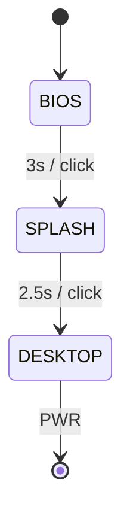
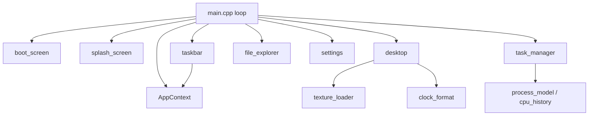

# CSOPESY Desktop OS Mockup

A pixel-faithful recreation of the **CSOPESY Desktop OS Emulator** built in C++20 with Dear ImGui.
The application boots through an animated BIOS POST screen and loading splash before landing on a
fully interactive desktop — complete with a live clock, bliss-style wallpaper, a bottom taskbar,
and three independently togglable windows (File Explorer, Settings, and a Windows-style Task Manager
with real-time animated process data). The only way to exit is the taskbar **PWR** button, mirroring
the required shutdown path described in the project specification.


---

## Features

### Boot sequence
- **BIOS POST screen** — monochrome text lines that reveal line-by-line (~0.12 s each) over a 3-second
  window, referencing real CSOPESY hardware specs and a fun Bemani Python 2 easter egg.
- **CSOPESY splash** — centered title at 4× font scale, subtitle, author credits, and an animated
  `Loading...` indicator with cycling dots.
- Both stages can be skipped instantly with a mouse click, Space, Enter, or Escape.

### Desktop
- **Wallpaper** — a bliss-style sky-and-hills image (`assets/wallpaper.png`) loaded as an OpenGL
  texture; if the file is missing a sky/grass gradient fallback is drawn automatically.
- **Live clock** — top-right corner, formatted as `Weekday, Mon DD, YYYY | HH:MM AM/PM`, updated
  every frame from the system clock.
- **PWR shutdown** — the red PWR button in the taskbar is the required and only exit path; it sets
  `ctx.shouldShutdown = true` which breaks the render loop cleanly.

### Taskbar
- Pinned to the bottom edge, always on top, 56 px tall.
- **Left cluster:** decorative `[#] Start`, `Files` (toggles File Explorer), `Settings` (toggles
  Settings), `Task Mgr` (toggles Task Manager).
- **Right cluster:** `VOL` (opens Settings on the Sound tab), `NET` (decorative), `PWR` (shutdown).

### Application windows
- **File Explorer** — two-pane layout with a folder tree (Desktop, Documents, Downloads, Games,
  System) and a resizable three-column file table.
- **Settings** — tabbed window: *Display* (dark accent toggle, resolution combo), *Sound* (master
  volume slider + progress bar), *About* (hardware specs and project credits). The VOL button jumps
  directly to the Sound tab via a one-shot tab-routing flag in `AppContext`.
- **Task Manager** — Windows-style process table (Process / PID / CPU % / Memory MB) with per-frame
  LCG-jitter animation, an aggregate CPU % + memory % status bar, and a scrollable CPU history
  spark-line graph rendered with `ImGui::PlotLines`.

---

## Screenshots

| Screen | Preview |
|--------|---------|
| BIOS POST |  |
| CSOPESY Splash |  |
| Desktop |  |
| File Explorer |  |
| Settings |  |
| Task Manager |  |

---

## Architecture

### State machine

The application progresses through three states. Transitions are driven by elapsed time **or** a
skip input, and the Desktop state is terminal — the only exit is via `shouldShutdown`.



### Component / data-flow



### Design notes

**Single source of truth.** `AppContext` (declared in `src/app_context.h`) is the only mutable
shared state in the program. Every render unit receives it by reference; none of them own state
themselves. This makes the boot state machine, window-open flags, wallpaper texture handle, volume,
and task-manager data trivially accessible from any subsystem without global variables.

**Logic / render split.** The `csopesy_logic` static library (`clock_format`, `boot_state`,
`process_model`, `texture_paths`, and the `CpuHistory` header-only class) contains zero ImGui
includes. This isolation means the logic units can be compiled and exercised by the doctest suite
without an OpenGL context, and the CMake dependency graph stays clean — the main executable links
`csopesy_logic`, while the test binary links only `csopesy_logic`.

---

## Project structure

```
Desktop-Style-OS-Mockup/
├── src/
│   ├── main.cpp                          # GLFW window, ImGui setup, render loop, state dispatch
│   ├── app_context.h                     # Shared AppContext struct (single source of truth)
│   ├── logic/
│   │   ├── boot_state.h / .cpp           # advanceBootState() — pure state-machine transition
│   │   ├── clock_format.h / .cpp         # formatClock() — std::tm -> display string
│   │   ├── cpu_history.h                 # CpuHistory ring-buffer class (header-only)
│   │   ├── process_model.h / .cpp        # ProcessRow, LCG jitter, aggregates, default list
│   │   └── texture_paths.h / .cpp        # wallpaperCandidatePaths() — path resolution
│   └── render/
│       ├── boot_screen.h / .cpp          # BIOS POST text-reveal renderer
│       ├── splash_screen.h / .cpp        # CSOPESY loading splash renderer
│       ├── desktop.h / .cpp              # Wallpaper draw, gradient fallback, clock overlay
│       ├── taskbar.h / .cpp              # Bottom taskbar with all button logic
│       ├── texture_loader.h / .cpp       # stb_image wallpaper loader -> OpenGL texture
│       └── windows/
│           ├── file_explorer.h / .cpp    # Two-pane file explorer window
│           ├── settings.h / .cpp         # Tabbed settings window (Display / Sound / About)
│           └── task_manager.h / .cpp     # Animated process table + CPU graph
├── tests/
│   ├── test_main.cpp                     # doctest runner entry point
│   ├── test_clock_format.cpp             # Clock output format and AM/PM padding
│   ├── test_boot_state.cpp               # State machine timeout + skip transitions
│   ├── test_process_model.cpp            # LCG determinism, clamp ranges, aggregates
│   ├── test_cpu_history.cpp              # Ring-buffer capacity and order
│   └── test_texture_paths.cpp            # Candidate path generation
├── tools/
│   ├── make_wallpaper.cpp                # Standalone wallpaper generator (stb_image_write)
│   ├── capture_window.ps1                # Helper script for capturing screenshots
│   └── click_client.ps1                  # Helper script for automated UI interaction
├── assets/
│   └── wallpaper.png                     # Generated bliss-style wallpaper (720p)
├── third_party/
│   ├── doctest.h                         # doctest v2.4.11 single-header test framework
│   ├── stb_image.h                       # stb_image — image loading
│   └── stb_image_write.h                 # stb_image_write — image generation
├── docs/
│   └── images/                           # Screenshots: bios, splash, desktop, explorer, settings, taskmgr
└── CMakeLists.txt                        # Build system (FetchContent: ImGui v1.91.5, GLFW 3.4)
```

---

## Build & Run

### Prerequisites

| Requirement | Minimum version | Notes |
|-------------|----------------|-------|
| CMake | 3.16 | Needed for `FetchContent` |
| C++ compiler | C++20 | Visual Studio 2022+ or GCC 13+ for `<format>`; snprintf fallback otherwise |
| Network access | — | First configure clones ImGui v1.91.5 and GLFW 3.4 automatically |

### Visual Studio 2022 / 2026 (MSVC, x64) — primary

```bash
cmake -B build -A x64
cmake --build build --config Release
```

Run from the **repo root** so that `assets/wallpaper.png` resolves correctly:

```bash
build\Release\csopesy_os.exe
```

### MinGW GCC 13+ — alternative

```bash
cmake -B build -G "MinGW Makefiles"
cmake --build build
```

Run from the **repo root**:

```bash
build\csopesy_os.exe
```

> **Important:** Always launch the executable from the repository root directory.
> The wallpaper loader searches `assets/wallpaper.png` relative to the current working directory.
> If the file is not found the application falls back to a gradient and continues normally.

---

## Controls

| Context | Input | Action |
|---------|-------|--------|
| BIOS / Splash | Left-click, Space, Enter, or Escape | Skip to the next stage immediately |
| Desktop — taskbar | **Files** | Toggle File Explorer window |
| Desktop — taskbar | **Settings** | Toggle Settings window |
| Desktop — taskbar | **Task Mgr** | Toggle Task Manager window |
| Desktop — taskbar | **VOL** | Open Settings and jump to the Sound tab |
| Desktop — taskbar | **PWR** | Shut the application down cleanly (required exit path) |

---

## Code walkthrough

### 1. Main-loop state dispatch (`src/main.cpp`)

```cpp
// --- advance state machine ---
double now = glfwGetTime();
double elapsed = now - ctx.stateEnteredTime;
csopesy::AppState next = csopesy::advanceBootState(
    ctx.state, elapsed, ctx.skipRequested, ctx.timings);
if (next != ctx.state) { ctx.state = next; ctx.stateEnteredTime = now; }

// Elapsed time WITHIN the current state, valid after a possible transition
// reset above (so a freshly-entered state starts at ~0.0 this frame).
double stateElapsed = now - ctx.stateEnteredTime;

// --- per-state rendering ---
switch (ctx.state) {
    case csopesy::AppState::Bios:    csopesy::renderBootScreen(ctx, stateElapsed); break;
    case csopesy::AppState::Splash:  csopesy::renderSplash(ctx, stateElapsed); break;
    case csopesy::AppState::Desktop:
        csopesy::renderDesktopBackground(ctx);
        csopesy::renderTaskbar(ctx);
        csopesy::renderFileExplorer(ctx);
        csopesy::renderSettings(ctx);
        csopesy::renderTaskManager(ctx);
        break;
}
```

Each frame, `advanceBootState` is consulted for a possible state transition. When a transition
occurs, `stateEnteredTime` is reset to `now` so the incoming state's elapsed timer starts at ~0.
The `switch` then dispatches to exactly the right set of render calls for the current state.

### 2. Boot state machine (`src/logic/boot_state.cpp`)

```cpp
AppState advanceBootState(AppState current, double elapsedInState,
                          bool skipRequested, const BootTimings& t) {
    switch (current) {
        case AppState::Bios:
            return (skipRequested || elapsedInState >= t.biosDuration)
                       ? AppState::Splash : AppState::Bios;
        case AppState::Splash:
            return (skipRequested || elapsedInState >= t.splashDuration)
                       ? AppState::Desktop : AppState::Splash;
        case AppState::Desktop:
        default:
            return AppState::Desktop;
    }
}
```

A pure function with no side effects: given the current state, elapsed time, and a skip flag it
returns the next state. Because it has no dependencies on ImGui or GLFW it is trivially unit-tested.
`BootTimings` defaults to `{3.0, 2.5}` seconds for BIOS and Splash respectively.

### 3. Wallpaper draw + gradient fallback (`src/render/desktop.cpp`)

```cpp
static void drawGradientFallback(ImDrawList* dl, ImVec2 p0, ImVec2 p1) {
    ImU32 top = IM_COL32(70,130,200,255), bot = IM_COL32(150,200,235,255);
    float horizon = p0.y + (p1.y - p0.y) * 0.70f;
    dl->AddRectFilledMultiColor(p0, ImVec2(p1.x, horizon), top, top, bot, bot);
    dl->AddRectFilled(ImVec2(p0.x, horizon), p1, IM_COL32(80,150,60,255));
}

void renderDesktopBackground(const AppContext& ctx) {
    const ImGuiViewport* vp = ImGui::GetMainViewport();
    ImDrawList* bg = ImGui::GetBackgroundDrawList();
    ImVec2 p0 = vp->Pos;
    ImVec2 p1 = ImVec2(vp->Pos.x + vp->Size.x, vp->Pos.y + vp->Size.y);

    if (ctx.wallpaperLoaded && ctx.wallpaperTex)
        bg->AddImage((ImTextureID)(intptr_t)ctx.wallpaperTex, p0, p1);
    else
        drawGradientFallback(bg, p0, p1);
```

The background is drawn directly into ImGui's background draw list, behind all windows. If the
wallpaper texture loaded successfully it is stretched to fill the viewport; otherwise the gradient
fallback paints a blue-to-light-blue sky gradient above a solid green ground strip.

### 4. Animated Task Manager process table (`src/render/windows/task_manager.cpp`)

```cpp
// advance the dummy values every frame the Task Manager is toggled open
// (continues even when the window is collapsed to its title bar)
for (auto& p : ctx.processes) updateProcess(p);
float cpu = aggregateCpu(ctx.processes);
float memTotal = 8192.0f; // pretend 8 GB
float memPct = (aggregateMemMB(ctx.processes) / memTotal) * 100.0f;
if (memPct > 100.0f) memPct = 100.0f;   // keep the readout plausible
ctx.cpuHistory.push(cpu);

ImGui::PlotLines("##cpu", ctx.cpuHistory.data(), (int)ctx.cpuHistory.size(),
                 0, "CPU history", 0.0f, 100.0f, ImVec2(-1, 80));
ImGui::Separator();

if (ImGui::BeginTable("procs", 4,
        ImGuiTableFlags_Borders | ImGuiTableFlags_RowBg |
        ImGuiTableFlags_Resizable | ImGuiTableFlags_ScrollY,
        ImVec2(0, 260))) {
    ImGui::TableSetupColumn("Process");
    ImGui::TableSetupColumn("PID");
    ImGui::TableSetupColumn("CPU %");
    ImGui::TableSetupColumn("Memory (MB)");
    ImGui::TableHeadersRow();
    for (const auto& p : ctx.processes) {
        ImGui::TableNextRow();
        ImGui::TableSetColumnIndex(0); ImGui::TextUnformatted(p.name);
        ImGui::TableSetColumnIndex(1); ImGui::Text("%d", p.pid);
        ImGui::TableSetColumnIndex(2); ImGui::Text("%.1f", p.cpu);
        ImGui::TableSetColumnIndex(3); ImGui::Text("%.0f", p.memMB);
    }
    ImGui::EndTable();
}
```

Each frame `updateProcess` steps every row's LCG RNG and applies a small delta to `cpu` and
`memMB`, clamped to `[0, 100]` and `[1, 4096]` respectively. The rolling `CpuHistory` ring-buffer
(capacity 90 samples) feeds the spark-line graph directly via its contiguous `float*` buffer.

---

## Testing

Run the unit test suite with CTest from the repo root after building:

```bash
# MSVC
ctest --test-dir build -C Release

# MinGW
ctest --test-dir build
```

Expected output: **15 test cases** pass (the doctest runner also reports the total assertion count,
which exercises approximately 20,000 individual checks across stress iterations).

### Test coverage

| Test file | Logic unit | What is verified |
|-----------|-----------|-----------------|
| `test_clock_format.cpp` | `clock_format` | Reference-style formatted output, AM/PM, zero-padded day/minute |
| `test_boot_state.cpp` | `boot_state` | Timeout and skip transitions for each state; Desktop is terminal |
| `test_process_model.cpp` | `process_model` | LCG determinism, CPU/memory clamp ranges over 5 000 iterations, aggregate functions |
| `test_cpu_history.cpp` | `cpu_history` | Ring-buffer capacity enforcement, FIFO ordering, empty-fill behaviour |
| `test_texture_paths.cpp` | `texture_paths` | Candidate path list includes exe-relative and cwd-relative entries |

---

## Credits

- **Authors:** S09 Group 2 — Cumti, Dulatre, Hong, Pineda (De La Salle University, CSOPESY).
- **[Dear ImGui](https://github.com/ocornut/imgui)** (v1.91.5) by Omar Cornut and contributors —
  immediate-mode GUI framework.
- **[GLFW](https://www.glfw.org/)** (3.4) — OpenGL window and input.
- **[stb_image / stb_image_write](https://github.com/nothings/stb)** by Sean Barrett — single-header
  image loading and PNG generation.
- **[doctest](https://github.com/doctest/doctest)** (v2.4.11) by Viktor Kirilov — single-header C++
  testing framework.
